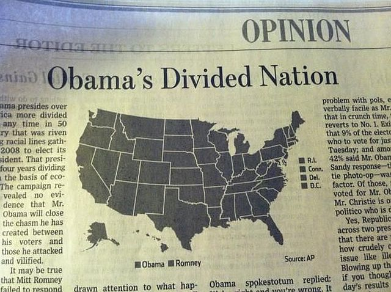
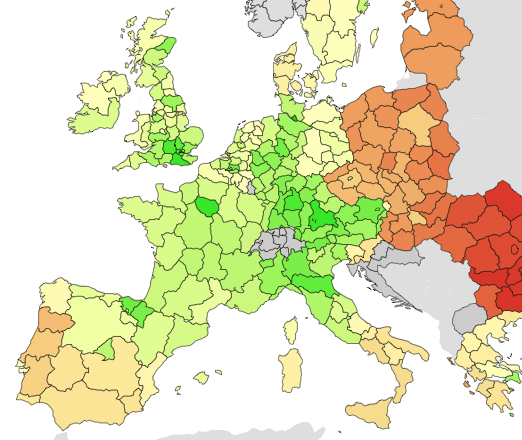
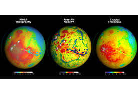
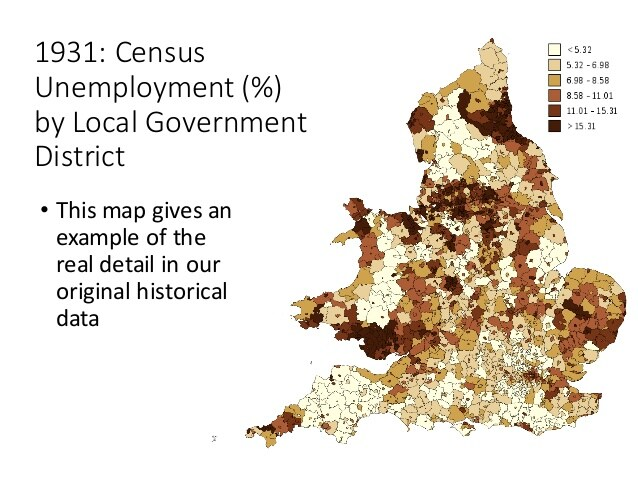
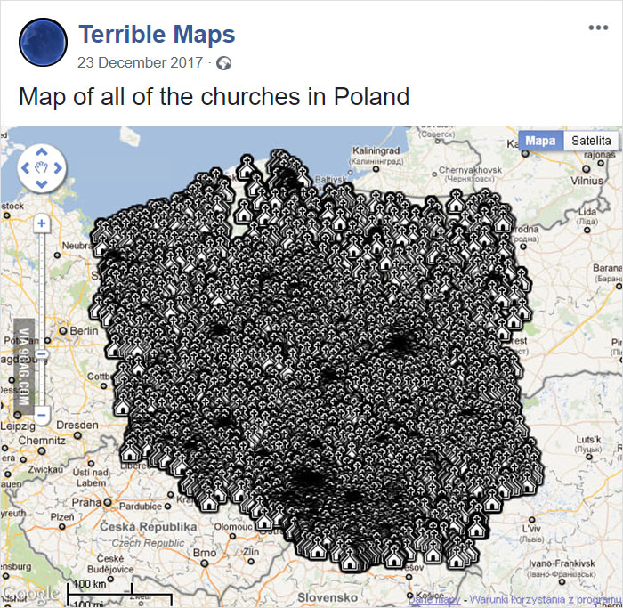
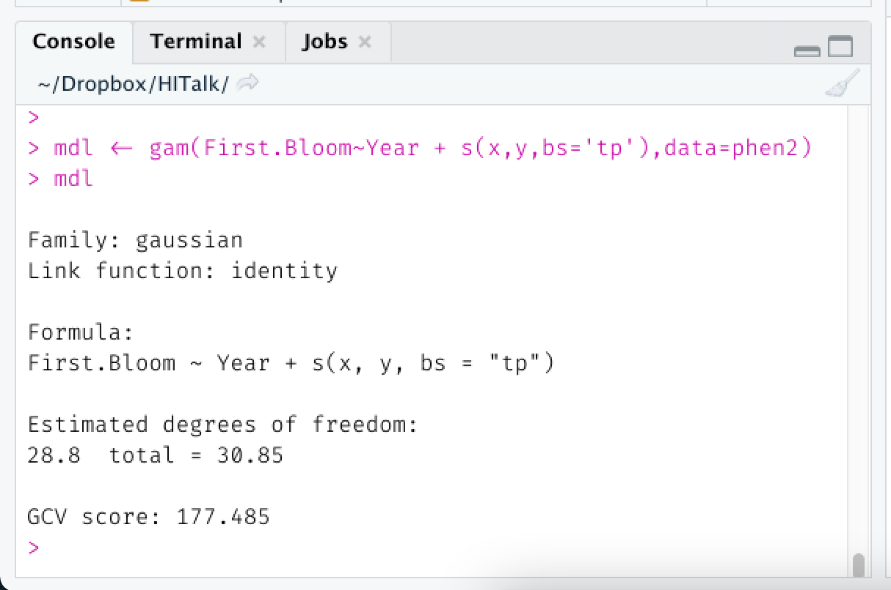

```{r setup, include=FALSE}
knitr::opts_chunk$set(echo = FALSE,message=FALSE,warning=FALSE)
library(tidyverse)
library(deSolve)
library(scales)
library(lubridate)
library(sf)
library(maptools)
library(sp)
library(csodata)
library(nlme)
```
```{r, results='hide',cache=TRUE}

popns <- read_csv('popns.csv')

cty <- st_read('county.json',crs=29902) %>% left_join(popns) 

Ws <- st_touches(cty,cty,sparse = FALSE) + 0
diag(Ws) <- rowSums(Ws)*2
Ws<- sweep(Ws,2,colSums(Ws),'/')

seed_cases <- rep(0,26)
seed_cases[6] <- 100
parameters <- c(beta=0.36, gamma=1/6, N=cty$Popn, W=Ws)
init  <- c(S=cty$Popn - seed_cases, I=seed_cases, R=rep(0,26))
times <- seq(0, 200, by = 1)

MODEL <- function(time, state, parameters) {
  with(as.list(c(state, parameters)), {
    
    # Unravel the values in vector form 
    
    S <- matrix(state[01:26], nrow = 26, ncol=1)
    I <- matrix(state[27:52], nrow = 26, ncol=1)
    R <- matrix(state[53:78], nrow = 26, ncol=1)
    
    N <- matrix(parameters[  03:28 ], nrow=26, ncol=1)
    W <- matrix(parameters[-(01:28)], nrow=26, ncol=26)
    
    # Specify the model
    
    dS <- -(S * beta) * (W %*% I)/N
    dI <-  (S * beta) * (W %*% I)/N - gamma * I
    dR <-  gamma * I
    
    return(list(c(dS, dI, dR)))
  })
}

out <- ode(y=init, times=times, func=MODEL, parms=parameters)
res <- data.frame(out[,c(1,28:53)]) 
colnames(res) <- c("SimDay",cty$COUNTY)
res <- res %>% 
  as_tibble() %>% 
  pivot_longer(CARLOW:WICKLOW,names_to="COUNTY",values_to = "I") %>%
  mutate(Date = ymd('2020-02-29') + SimDay)

dates <- seq(ymd('2020-04-09'),ymd('2020-5-14'),by='week')
early <- res %>% 
  filter(Date %in% dates)
early <- cty %>% left_join(early)

```

## Geocomputation?

:::::{.cols data-latex=""}
::::{.col data-latex="{0.48\linewidth}"}
::: {.block data-latex="{OK, so what is it?}"}
  - Very simply: *"Using computers to solve otherwise tricky geographical problems"*
    - Data analytics
    - Data visualisation
    - Data handling
    - Data acquisition
  - Often very much an *applied* discipline
  - For this short talk, I will focus on:
    - **visual** aspects
    - Applications
:::
::::
::::{.col data-latex="{0.04\linewidth}"}
\ 
::::
::::{.col data-latex="{0.48\linewidth}"}
```{r, echo=FALSE, out.width='100%',fig.align='center'}
knitr::include_graphics('movemap.png')
```
::::
:::::

## What areas of application are there?

:::::{.cols data-latex=""}
::::{.col data-latex="{0.48\linewidth}"}

\Large

  - Several:
    - \Large Epidemiology
    - Crime Pattern Analysis
    - Transport
    - Climate Data Analysis
    - House Price Analysis
    - Lots more ...
::::


::::{.col data-latex="{0.04\linewidth}"}
\ 
::::

::::{.col data-latex="{0.48\linewidth}"}
```{r, cache=TRUE}
ggplot(early,aes(fill=I)) + geom_sf() + facet_wrap(~Date) + scale_fill_viridis_c(trans='log10',name='Covid19\nCases') 
```
::::
:::::

## So is Geocomputation just drawing maps?

:::::{.center data-latex=""}

Even if that were true, drawing useful maps is harder than many people think!

:::: {.cols data-latex=""}
:::{.col data-latex="{0.3\linewidth}"}
```{r echo=FALSE,out.width='100%'}

```
:::
:::{.col data-latex="{0.3\linewidth}"}
```{r echo=FALSE,out.width='98%',fig.align='center'}
knitr::include_graphics('super_bowl_wins.jpeg')
```
:::
:::{.col data-latex="{0.3\linewidth}"}
```{r echo=FALSE,out.width='100%'}

```
:::
::::
:::: {.cols data-latex=""}
:::{.col data-latex="{0.3\linewidth}"}
```{r echo=FALSE,out.width='100%'}

```
:::
:::{.col data-latex="{0.3\linewidth}"}
```{r echo=FALSE,out.width='98%',fig.align='center'}

```
:::
:::{.col data-latex="{0.02\linewidth}"}
\ 
:::
:::{.col data-latex="{0.3\linewidth}"}
```{r echo=FALSE,out.width='80%'}

```
:::
::::
:::::

## So what else is there? 


::::: {.cols data-latex=""}

::::{.col data-latex="{0.38\linewidth}"}

  - Analytics of geographical data
    - Typology of commercial precincts in Queensland, Australia
    - By weekly cycles of crime
    - Plot shows relative risk in cycle
    - ... and uncertainty
    
::: {.block data-latex="{}"}
\fontsize{5}{6} \selectfont Corcoran J, Zahnow R, Kimpton A, Wickes R, Brunsdon C. The temporality of place: Constructing a temporal typology of crime in commercial precincts. \newline doi:10.1177/2399808319846904
:::
::::

:::{.col data-latex="{0.02\linewidth}"}
\ 
:::

:::{.col data-latex="{0.6\linewidth}"}

```{r, out.width='100%'}
knitr::include_graphics('crimeclus2.pdf')
```
:::
::::


```{r getdata,results='hide',echo=FALSE}
 load('pheno.RData')
 # phen <- st_as_sf(phen)
 phen2 <- st_transform(phen,5070)
 #phen2 <- spTransform(phen,CRS("+proj=aea +lat_1=29.83333333333334 +lat_2=45.83333333333334 +lat_0=37.5 +lon_0=-96 +x_0=0 +y_0=0 +ellps=WGS84 +datum=WGS84 +units=m +no_defs"))
 # cat(paste(raw.source[26:30],collapse="\n"))

 valid <- phen2[!is.na(phen2$First.Bloom),]
 X <- cbind(valid$Year,valid$Elev)
 X <- sweep(X,2,colMeans(X))
 Y <- valid$First.Bloom
 Y <- Y - mean(Y)
 year <- valid$Year - mean(valid$Year)
 N <- length(Y)
 Nc <- ncol(X)

 mdl1 <- lm(Y~year)

 station <- match(valid$ID,unique(valid$ID))
 Ns <- max(station)
 mdl2 <- lme(Y~1+year,random=~1|station)

 c.ests <- coef(mdl2)[,1]
 cds <- st_coordinates(valid)[which(!duplicated(valid$ID)),]
 cds.p <- cds[c.ests>0,]
 cds.m <- cds[c.ests<0,]
 
 mdl3 <- lme(Y~1+year,random=~(1+year)|station)

 b.ests <- coef(mdl3)[,2]
 cds <- st_coordinates(valid)[which(!duplicated(valid$ID)),]
 cds.p <- cds[b.ests>0,]
 cds.m <- cds[b.ests<0,]
# save(valid,station,year,c.ests,b.ests,cds,mdl1,mdl2,mdl3,phen,file='pheno.RData')
```

## Is Crowdsourced Geographical Data Useful?

:::::{.cols data-latex=""}
::::{.col data-latex="{0.3\linewidth}"}

  - Yes! But be mindful of the **geography** aspect...
  - Example: first bloom date of lilacs in the US
  - From `r length(unique(phen$ID))` locations over 4+ decades
  - Indicator of climate change?
  - Here we plot date vs. year
  - Date is getting later???
::::
:::: {.col data-latex="{0.02\linewidth}"}
\ 
::::
:::: {.col data-latex="{0.68\linewidth}"}
```{r hex, echo=FALSE,out.width='100%'}
phen <- phen %>% mutate(fbd=First.Bloom+ymd(20001231))
ggplot(phen,aes(x=Year,y=fbd)) + geom_hex(bins=c(47,10)) + geom_smooth(method='lm',col='yellow') + scale_y_date(name='First Bloom Date') + scale_x_continuous(name="Year of Observation")
```
::::
:::::

## Why is previous result counter-intuitive?

:::::{.cols data-latex=""}
::::{.col data-latex="{0.3\linewidth}"}
  - We need to consider history of data collection
  - Early years mainly further west
  - Eastern locations came later
  - But these have a later onset of spring
::::
::::{.col data-latex="{0.02\linewidth}"}
\ 
::::
::::{.col data-latex="{0.68\linewidth}"}

```{r timegaps,out.width='100%'}
ggplot(phen,aes(x=Long,y=Year)) + geom_point() + scale_x_continuous(name="Longitude (Degrees West)",labels=abs)
```
::::
:::::

## Can we compensate for this?

:::::{.cols data-latex=""}
::::{.col data-latex="{0.48\linewidth}"}
:::{.block data-latex="{Yes: Incorporate geographical effect}"}

  - Use thin plate spline (TPS)
  - $D = a + bY + f(x,y) + \epsilon$
    - $D$ First bloom day
    - $Y$ Year
    - $f(x,y)$ spatial trend, TPS function
    - $(x,y)$ Coordinates of location
    - $\epsilon$  Gaussian error term
    
:::
::::
::::{.col data-latex="{0.04\linewidth}"}
\ 
::::
::::{.col data-latex="{0.48\linewidth}"}

  - Model fitted using R via `mgcv` package
  
```{r, out.width='100%'}

```
::::
:::::

\vspace{2em}

::: {.block data-latex="{}"}
\fontsize{5}{6} \selectfont Brunsdon, C. and Comber, A.J. (2012). Experiences with Citizen Science: Assessing Changes in the North American Spring. Geoinformatica DOI 10.1007/s10707- 012-0159-6
:::

## Is There A Geographical Effect?

```{r}
library(mgcv)
library(tmap)
load('us.RData')
phen2 <- phen2 %>% mutate(x=st_coordinates(phen2)[,1],y=st_coordinates(phen2)[,2])
mdl <- gam(First.Bloom~Year + s(x,y,bs='tp'),data=phen2)
pred <- predict(mdl,type='terms',newdata=phen2)
phen2 <- phen2 %>% mutate(geo=pred[,2])
tm_shape(us) + tm_polygons(col='darkgrey') + tm_shape(phen2) + tm_dots(col='geo',size=0.3,style='cont',palette='RdYlBu',title='Lead/Lag')
```

## Does that change things?

:::::{.cols data-latex=""}
::::{.col data-latex="{0.3\linewidth}"}

  - Again, yes. 
  - Plot on right shows **corrected** first bloom day
  - Line is now the one from the new model
  - Suggests a slow trend to earlier first bloom
  - About 1 day in 7 years
  - Similar to other studies
::::
:::: {.col data-latex="{0.02\linewidth}"}
\ 
::::
:::: {.col data-latex="{0.68\linewidth}"}
```{r hex2, echo=FALSE,out.width='100%'}
phen2 <- phen2 %>% mutate(cfb=First.Bloom-geo+ymd(20001231))
ggplot(phen2,aes(x=Year,y=cfb)) + geom_hex(bins=c(47,10)) + scale_y_date(name='First Bloom Date (Corrected)') + scale_x_continuous(name="Year of Observation") + geom_abline(slope= mdl$coefficients['Year'],intercept=mdl$coefficients['(Intercept)']+ymd(20001231),col='yellow',lwd=1.5)
```
::::
:::::

## What if change isn't steady?

:::::{.cols data-latex=""}
::::{.col data-latex="{0.3\linewidth}"}

  - Alternative model: $D = a + bf_T(Y) + f_S(x,y) + \epsilon$
  - $f_T$ and $f_S$ are space and time splines
  - Time trend is now possibly non-linear 
  - Suggests advancement actually faster in recent years.

::::
:::: {.col data-latex="{0.02\linewidth}"}
\ 
::::
:::: {.col data-latex="{0.68\linewidth}"}
```{r hex3, echo=FALSE,out.width='100%'}
mdl2 <- gam(First.Bloom~s(Year,bs='cr',k=3) + s(x,y,bs='tp'),data=phen2)
pt <- predict(mdl2,newdata=phen2,type='terms')
phen2 <- phen2 %>% mutate(geo2=pt[,2],yt=pt[,1])
phen2 <- phen2 %>% mutate(cfb=First.Bloom-geo2+ymd(20001231))
trend <- phen2 %>% group_by(Year) %>% summarise(fbd=first(yt)+ymd(20001231)+mdl2$coefficients['(Intercept)']) %>% arrange(Year)
ggplot(phen2,aes(x=Year,y=cfb)) + geom_hex(bins=c(47,10)) + scale_y_date(name='First Bloom Date (Corrected)') + scale_x_continuous(name="Year of Observation") +
geom_line(data=trend,mapping=aes(x=Year,y=fbd),col='yellow',lwd=1.5) 
```
::::
:::::

## So Is Crowdsourced Data Useful?

\Large

  - From the example, I think so
  - BUT
    - \large We need to remember this isn't a designed experiment
    - We need to know something about the data collection process
    - We need to allow for these factors when modelling
  - Arguably,  in this example the geographical part was a 'nuisance factor'
  - It got in the way of estimating the advancement rate for first bloom day.
  - But estimating it was an interesting side effect of the study!

