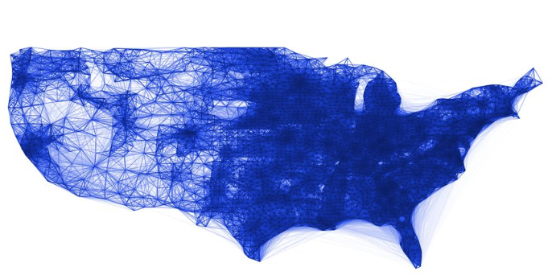

```{r setup, include=FALSE}
knitr::opts_chunk$set(echo = FALSE)
```

## Geocomputation?

:::::{.cols data-latex=""}
::::{.col data-latex="{0.48\linewidth}"}
::: {.block data-latex="{OK, so what is it?}"}
  - Very simply: *"Using computers to solve otherwise tricky geographical problems"*
    - Data analytics
    - Data visualisation
    - Data handling
    - Data acquisition
  - Often very much an *applied* discipline
  - For this short talk, I will focus on:
    - **visual** aspects
    - Applications
:::
::::
::::{.col data-latex="{0.04\linewidth}"}
\ 
::::
::::{.col data-latex="{0.48\linewidth}"}
```{r, echo=FALSE, out.width='100%',fig.align='center'}

```
::::
:::::

## So is Geocomputation just drawing maps?

:::::{.center data-latex=""}

Even if that were true, drawing useful maps is harder than many people think!

:::: {.cols data-latex=""}
:::{.col data-latex="{0.3\linewidth}"}
```{r echo=FALSE,out.width='100%'}
knitr::include_graphics('divided_nation.jpg')
```
:::
:::{.col data-latex="{0.3\linewidth}"}
```{r echo=FALSE,out.width='98%',fig.align='center'}
knitr::include_graphics('super_bowl_wins.jpeg')
```
:::
:::{.col data-latex="{0.3\linewidth}"}
```{r echo=FALSE,out.width='100%'}
knitr::include_graphics('redgreen.png')
```
:::
::::
:::: {.cols data-latex=""}
:::{.col data-latex="{0.3\linewidth}"}
```{r echo=FALSE,out.width='100%'}
knitr::include_graphics('images.jpeg')
```
:::
:::{.col data-latex="{0.3\linewidth}"}
```{r echo=FALSE,out.width='98%',fig.align='center'}

```
:::
:::{.col data-latex="{0.02\linewidth}"}
\ 
:::
:::{.col data-latex="{0.3\linewidth}"}
```{r echo=FALSE,out.width='80%'}
knitr::include_graphics('churchpol.jpg')
```
:::
::::
:::::

## Slide with R Output

```{r cars, echo = TRUE}
summary(cars)
```

## Slide with Plot

```{r pressure}
plot(pressure)
```

